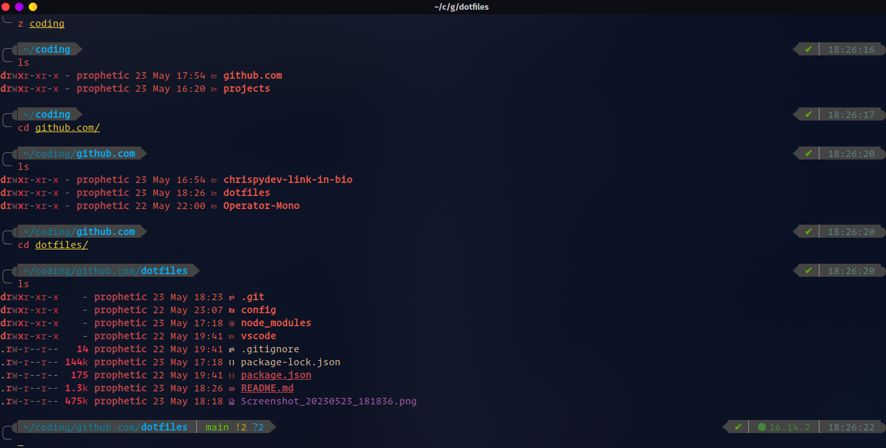
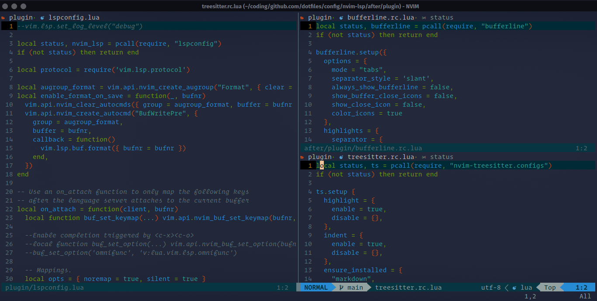

### App I used freequently

- Vscode
  - coding almost any project.
  - Download from the vscode website
- Pycharm Professional Edition
  - coding python project.
  - From jetbrains wesbsite or from the app store
- Min Browser
  - A minimal web browser and save browser for working.
  - Can be installed on arch linux with
  ```bash
  yay -S min
  ```
- Brave Browser
  - A browser powered by chrominium, fast and secure.
  - Can be installed from the arch linux app store
- notion
  - A notes keeping app.
- Ms Edge
  - Mainly used for reading slides
  - From the arch linux app store
- Audacious
  - An audio player for playing music
    install during setup
- Proton Vpn
  - For visiting websites like [npmjs](https://www.npmjs.com/package/react-router-dom)
  - Can be installed from the arch linux app store
- GuiScrpy
  - A Gui for scrpy
  - For scren casting android phone to your computer

### Installing helper apps

> for pyenv, startship, fisher

```bash
curl https://pyenv.run | bash # comment the pyenv from the fish config.fish file
curl -o- https://raw.githubusercontent.com/nvm-sh/nvm/v0.39.1/install.sh | bash
nvm install v16.14.2
nvm alias default v16
curl -sS https://starship.rs/install.sh | sh
# Do this to install fisher first incase you don't have it
curl -sL https://raw.githubusercontent.com/jorgebucaran/fisher/main/functions/fisher.fish | source && fisher install jorgebucaran/fisher
fisher install edc/bass
fisher install jethrokuan/z
```

## For nvim config visit the nvim folder thank you 👍
