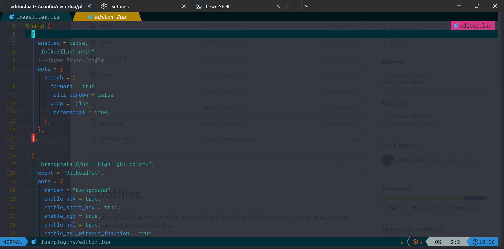

Personal development environment and configuration files for a consistent, productive, and keyboard-focused workflow.

## Contents

- **Fish** — Shell configuration, aliases, functions, and plugins
- **Fonts** — Fonts used across my development environment
- **Neovim** — LazyVim-based editor configuration, plugins, keybindings, and UI
- **PowerShell** — PowerShell configuration and customization
- **tmux** — Terminal multiplexer configuration
- **Zed** — Zed editor configuration and preferences
- **Git** — Global Git configuration
- **Commitizen** — Commit message configuration

## Structure

```text
dotfiles/
├── fish/
├── fonts/
├── nvim/
├── powershell/
├── tmux/
├── zed/
├── .czrc
├── .gitconfig
├── LICENSE
└── README.md
```

## Requirements
Depending on the configuration being used:
  - Git
  - Fish
  - Neovim
  - LazyVim
  - tmux
  - Zed
  - PowerShell
  - Nerd Font
  - ripgrep
  - fd

## Installation

Clone the repository:
```bash
git clone https://github.com/chrispydev/dotfiles.git
```
Review and copy/link the configuration you need to the appropriate location on your system.

> **Note**: These are personal configurations. Review them before applying them to your system to avoid overwriting existing settings.
